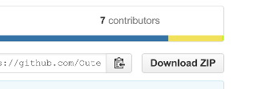

Download and set-up
===================

This section will discuss two things:

- obtaining the Librarian source code
- setting up the development environment

Prerequisites
-------------

In order to get Librarian up and running, you will need:

- A Linux computer or virtual machine
- Python 2.7.x (well, of course!)
- Build tools (GNU make, autotools, gcc, etc)
- PostgreSQL server
- ffmpeg and ffprobe

The build tools can be installed on most Linux systems using packages like
``build-essential``, ``base-devel``, and similar. On some systems (those that
have separate 'development' or 'source' packages) you may also need the Python
headers (development package such as ``python-dev``, ``python-devel``, etc),
PostgreSQL headers and libev headers. Enumerating distro-specific packages is
completely outside the scope of this text.

The ``ffmpeg`` and ``ffprobe`` command line utilities are also needed. These
are used when extracting metadata and creating image and video thumbnails.
Consult your distro's documentation for information on what packages provide
these tools.

Obtaining the sources
---------------------

Sources can be obtained by cloning from the `Librarian GitHub repository
<https://github.com/Outernet-Project/librarian/>`_. (Also see
:doc:`git_repository_layout`.) To clone the complete source tree from the mater
branch::

    $ git clone https://github.com/Outernet-Project/librarian.git

This will create a repository clone in a directory named ``librarian``. If you
wish to contribute changes back to the project, a better way is to first fork
the repository, and then clone the forked repository.

To download a snapshot of the repository, you can use the download button on
the `GitHub repository page <https://github.com/Outernet-Project/librarian/>`_.

    "Download ZIP" button is located just above the file/directory list to the
    right.

Setting up the development environment
--------------------------------------

Although you can develop using the local site-packages, we highly recommend
setting up a virtualenv.

To prepare the development environment, we simply run the ``perpare`` make
target. ::

    $ cd path/to/librarian/sources
    $ make prepare

This will perform the following:

- create development configuration for FSAL in ``tmp/fsal.ini``
- create development configuration for Librarian in ``tmp/librarian``
- create a local package index in ``/tmp/pypi``
- install Librarian editably (using ``pip install -e``)
- install dependencies from the local package index

See also :doc:`editable_install`.

Starting FSAL
-------------

Librarian usee `FSAL <https://github.com/Outernet-Project/fsal/>`_ (Filesystem
Abstraction Layer) to access the files. Therefore, before you can start
Librarian, FSAL must be running.

The following make target can be used to start FSAL::

    $ make start-fsal

Starting Librarian
------------------

To start Librarian, the ``librarian`` comman is used. Path to the configuration
file is specified using ``--conf`` command line argument. If you have followed
the instructions so far, the configuration file should be available at
``tmp/librarian.ini``. ::

    $ librarian --conf tmp/librarian.ini

Maintaining the setup
---------------------

When you switch branches, pull from the remote repositories, or otherwise
modify the files, you may need to update your set-up. In particular, you may
need to update one or more of the following:

- development FSAL configuration
- development Librarian configuration
- local mirror

To update the configuration files, simply remove the existing ones and run
``make`` with the path to the removed file. For example, to update
``tmp/librarian.ini``::

    $ rm tmp/librarian.ini
    $ make tmp/librarian.ini

To update the local package index::

    $ rm /tmp/pypi
    $ make local-mirror
