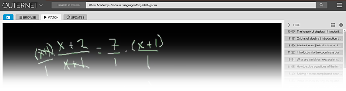

*********
Librarian
*********

Librarian is a content index manager and interface for `Outernet
<https://outernet.is/>`_ receivers. It is one of the two key components that
allow users to access the content that is broadast on Outernet. [#]_

This documentation provides an overview of both Librarian usage, and its inner
workings. The first few chapters will guide you through the Librarian
interface, followed by chapters that illuminate the inner workings of this
application.

If you are a programmer eager to modify Librarian or contribute to the project,
please skip ahead to :doc:`development`.

.. note::
    This documentation is work in progress and there are many missing chapters.
    Please bear with us as we rush to complete it.

Table of contents
=================

.. toctree::
    :maxdepth: 2
    
    user_manual
    development
    api_documentation
    make_targets
    git_repository_layout

Source code
===========

Source code for this program can be found `on GitHub
<https://github.com/Outernet-Project/librarian/>`_.

License and copyright
=====================

.. figure:: images/outernet.png

Copyright 2014-2016, Outernet Inc <apps@outernet.is>

Some rights reserved.

Source code license
-------------------

This program is free software: you can redistribute it and/or modify it under
the terms of the GNU General Public License as published by the Free Software
Foundation, either version 3 of the License, or (at your option) any later
version. You will find more information in the ``COPYING`` file in the source
tree.

Documentation license
---------------------

This documentation and any non-code files in the ``docs`` directory mayb be
freely redistributed and/or modified under the terms of the GNU Free
Documentation License version 1.3, or (at your option) any later version. You
will more information in the ``LICENSE`` file in the ``docs`` directory.

Trademarks
----------

Outernet wordmark and Outernet name are trademarks of Outernet Inc, and may not
be used without prior permission.

.. [#] The other is key component 
       `FSAL <https://github.com/Outernet-Project/fsal/>`_ (Filesystem
       Abstraction Layer)
